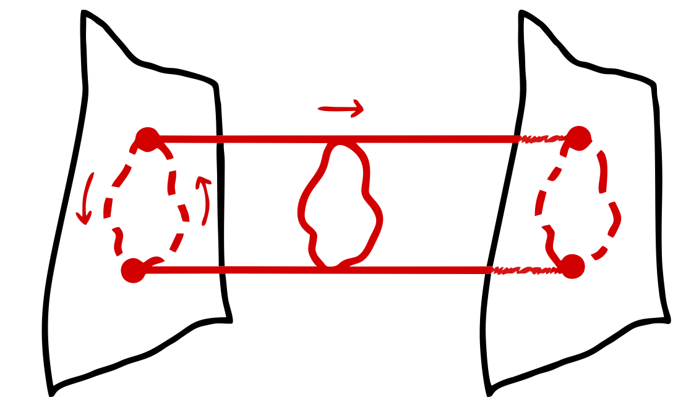

# AdS/QCD: Quantum Dynamics from Classical Gravity

## Modelling the Subatomic World
Protons and neutrons, the building blocks of atomic matter, are comprised of quarks bound together by the strong nuclear force. This force is mediated by gluons, the strength of which is set by the gauge coupling $g$. As $g$ increases, the quarks stick together, forming hadrons like the proton and neutron. For small $g$, the quarks and gluons are effectively free, producing a state of matter known as the quark-gluon plasma (QGP).
 
 
The value of $g$ for which this transistion occurs, and whether the transition is smooth (second-order) or discontinuous (first-order), is a question of great importance when modelling the strong force. However, whilst the field theoretic description of electromagnetism (known as quantum electrodynamics or QED) has been incredibly successful in describing electron-photon interactions, the field theory description of the strong force (known as quantum chromodynamics or QCD) breaks down in the crucial regime where quarks confine. This makes it impossible to compute QCD observables such as the hadron masses at strong coupling, nor gain a qualitative description of the mechanism that binds quarks together.
 
 
To break this impasse, we must formulate an alternate description of quark-gluon interactions that is valid for large $g$, the pursuit of which takes us to the strangest objects in the universe - black holes.

## Black Holes & the Information Paradox
Einstein's theory of general relativity describes gravity as the curvature of spacetime in the presence of mass. Whilst typically only significant over large distances, the extreme density of a black hole can cause dramatic changes in the curvature of spacetime across the width of a single atom. As such, black holes are ideal objects for studying phenomena affected by both gravity and quantum mechanics.
 
 

    

        One example is Hawking radiation. Quantum field theory describes particles as local excitations of space-filling matter fields. Since the quantum vacuum has a non-zero energy density, virtual particles constantly appear from empty space, a phenomena known as vacuum fluctuations. To preserve charge, these fluctuations always come in the form of particle-antiparticle pairs, quickly re-annihilating with one another and returning their energy to the vacuum. However, with a source of energy, and a mechanism for the particles to propogate independently, these virtual particles can become physical.
         
         
        In a black hole, these requirements are fulfilled by the gravitational potential and the event horizon respectively. Vacuum fluctuations at the horizon of a black hole produce these particle pairs, with one falling behind the horizon whilst the other, the Hawking radiation, escapes to infinity. Since the energy of the Hawking radiation is sourced by the gravitational field, an outside observer interprets this process as the emission of particles by the black hole, a process that gradually reduces the mass of the black hole until it eventually (after billions of years) evaporates.
         
         
    

    <figure>
        
        <figcaption>Hawking radiation arising from vacuum fluctuations about a black hole's event horizon. Adpated from S. Weinfurtner, Nature 569, 634-635 (2019)</figcaption>
    </figure>

Since the Hawking radiation was sourced just outside the event horizon, and we know that nothing from within the horizon can escape outside, one must conclude that this radiation carries no information from the black hole's interior. But, if the black hole is to evaporate and disappear, what can we say has become of the information that made it up? This is the <em>black hole information paradox</em>. To circumvent this paradox, we need to carefully consider what an outside observer actually sees as an object approaches a black hole.

## Our World as a Hologram
We know that the warping of spacetime around a black hole slows the internal clock of an infalling object relative to an outside observer, making the object appear frozen at the event horizon as the Lorentz $\gamma$ factor diverges to infinity. In contrast, the object observes nothing significant as it passes this critical radius. Rather, it continues its journey towards the singularity, unaware that it has become disconnected from the outside universe.
 
 

    <figure>
        
        <figcaption>The holographic principle proposes that the information within a black hole exists on the boundary of its event horizon. Adapted from A.Popli, Medium magazine (2025)</figcaption>
    </figure>
    

        This suggests two complementary descriptions of the same physics: the bulk (interior) and the boundary (exterior). From the outside, infalling information isn't lost inside the black hole but is preserved on the horizon, spreading out and entangling with existing degrees of freedom on the black hole's boundary. This is corroborated by the Bekenstein-Hawking entropy, which states that the information held by a black hole scales with its surface area, not its volume. The boundary description encodes the same information as the bulk, albeit in a scrambled, lower-dimensional form. Due to this difference in dimensionality, this concept is known as the <em>holographic principle</em>.
         
         
        As for quantum fluctuations at the event horizon, the Hawking radiation becomes entangled with the degrees of freedom present on the boundary, carrying this information away as the black hole evaporates. In principle, collecting all of this radiation would allow one to reconstruct everything that fell into the black hole, resolving the information paradox. 
    

Whilst important for our physical understanding of black holes, the holographic principle makes a deeper statement regarding the nature of our universe. If all the information contained within a given volume can be described by degrees of freedom present on its surface, are the four dimensions of our universe fundamental, or do they arise from an underlying theory that lives in a lower dimensional space? Furthermore, if the black hole interior is governed by a theory of quantum gravity, such as string theory, what theory describes the scrambled boundary? As it turned out, the answer to this question became one of the most important discoveries in modern theoretical physics.

## The AdS/CFT Correspondance
 The first functional implementation of the holographic principle, dubbed the AdS/CFT correspondance, proposed a duality between type-IIb superstring theory in a five-dimensional Anti de Sitter (AdS) spacetime and a four-dimensional conformal field theory (CFT) living on its boundary. Crucially, the duality mapped a gravitating theory to a quantum theory without gravity, implying that the fabric of space and time may <em>emerge</em> from quantum interactions in a lower-dimensional space. 
  
  
 Better yet, the AdS/CFT correspondance is a strong-weak duality, meaning that the dual description of a highly quantum (stringy) theory of gravity is a weakly-coupled (small $g$) CFT, for which the techniques used to solve problems in QED can be applied. Alternatively, one can map a strongly-coupled quantum field theory such as QCD to a non-quantum (classical) theory of gravity. In this case, the statement of the correspondance reads:
 
 
> a supersymmetric four-dimensional strongly-coupled conformal field theory with a large number of colour (gauge) charges is equivalent to classical supergravity on a ten-dimensional $AdS_5\times S_5$ background.

Unpacking this statement fully requires a large amount of pre-requisite information that will not be provided here. Instead, it will suffice to highlight the assumptions and symmetries that we wish to break in this statement so that the CFT described looks more like real-world QCD.

## CFT $\rightarrow$ QCD
There are three features of the above form of the AdS/CFT correspondance that are most at odds with QCD. We define them as follows:
 
 
* <strong>Conformal symmetry</strong> describes a physical system with no intrinsic mass or energy scale. In such a theory, the rate of change of the gauge coupling $g$ with respect to the probe energy $\mu$ vanishes at a so-called fixed point, meaning that the behaviour of the theory is the same across all energy scales. Though QCD does not possess this symmetry, the value of $g$ is very small when $\mu$ is large, making QCD approximately conformal in the high energy regime. Away from the fixed point, the value of $g$ increases as $\mu$ falls, shifting into the strongly-coupled regime when $\mu$ approaches the QCD scale $\Lambda_{QCD}$. This triggers the onset ofstrong coupling phenomena, such as the formation of quark-antiquark condensate, which go on to break additional symmetries and contribute to the effective constituent masses of quark bound states at low energy.  
* <strong>Supersymmetry</strong> is a symmetry between matter particles (fermions) and force carriers (bosons) that pairs each known particle with a superpartner of the opposite type, doubling the particle content of the standard model. This symmetry appears because supergravity is the low-energy limit of string theory, which requires supersymmetry in order to describe fermions; early versions of string theory constructed without supersymmetry were only able to describe bosonic matter. Although QCD does not exhibit supersymmetry, supersymmetric extensions of QCD are useful as toy models to facilitate otherwise impossible calculations in the strongly-coupled regime. As such, we only wish to break enough supersymmetry to include the neccesary matter content, keeping a residual amount for computations.  
* <strong>A large number of colours</strong> $N$ allows one to define an effective coupling $\lambda=g^2 N$ which naturally groups quark-gluon interactions according to their topology, forming an equivalence between large-$N$ QCD and the lowest order (tree-level) interactions in string theory. In reality, QCD only has three colour charges- red, blue and green - but many of the qualitative features of the theory are expected to persist from the large-$N$ limit. Whilst we do not wish to break this as such, we do wish to borrow results from the $N=3$ theory so that our models are consistent with QCD.
 
 

    

        Breaking these symmetries typically requires the introduction of additional D-branes into the underlying string theory. In AdS/CFT, D-branes are string-theoetic objects with a dual interpretation: they can be either viewed as sources for closed string (graviton) modes that shape the background geometry via gravity, or as objects upon which open strings end, giving rise to gauge and matter fields.
         
         
        In this picture, the open string endpoints (where the fields live) are restricted to the brane surface, whilst the closed strings can propagate freely throughout the higher-dimensional spacetime. This provides an intuitive picture for why the gravitational description involves an additional dimension relative to the gauge theory in the AdS/CFT correspondence; it is because of this dual description of D-branes.
    

    <figure>
        
        <figcaption>D-branes both source closed strings (gravitons) and act as endpoints for open strings (gauge fields), resulting in the the AdS/CFT correspondence.</figcaption>
    </figure>

## My Research: AdS/QCD at Finite Temperature
In my research, I construct specific configurations of string-theoretic objects in five-dimensional AdS space that, in the supergravity limit, produce dual descriptions of strongly-coupled quark-gluon interactions, including those at finite temperature attained by the insertion of a Schwarzchild black hole into the bulk gravitating geometry. These objects include hypersurfaces called D-branes that act as a source of gravitons (the quanta of gravity) as well as momentum conserving endpoints for the open strings that describe quarks and gluons. This dual interpretation of D-branes actually lies at the heart of the AdS/CFT correspondance, the intuition for which can be seen in the image to the right.

My first paper, published in 2023, used the perturbative running coupling constant $g$ from QCD to calculate the mass of a generic $n$-quark state, attaining an improved prediction for the proton mass compared to other holographic models. My recent work explores the phase transition of the quark-gluon plasma, predicting the lifetime of quark-based dark matter candidates such as the sexaquark.

