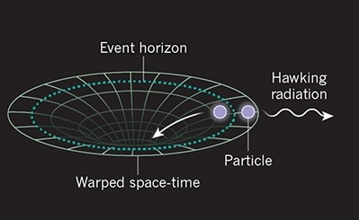
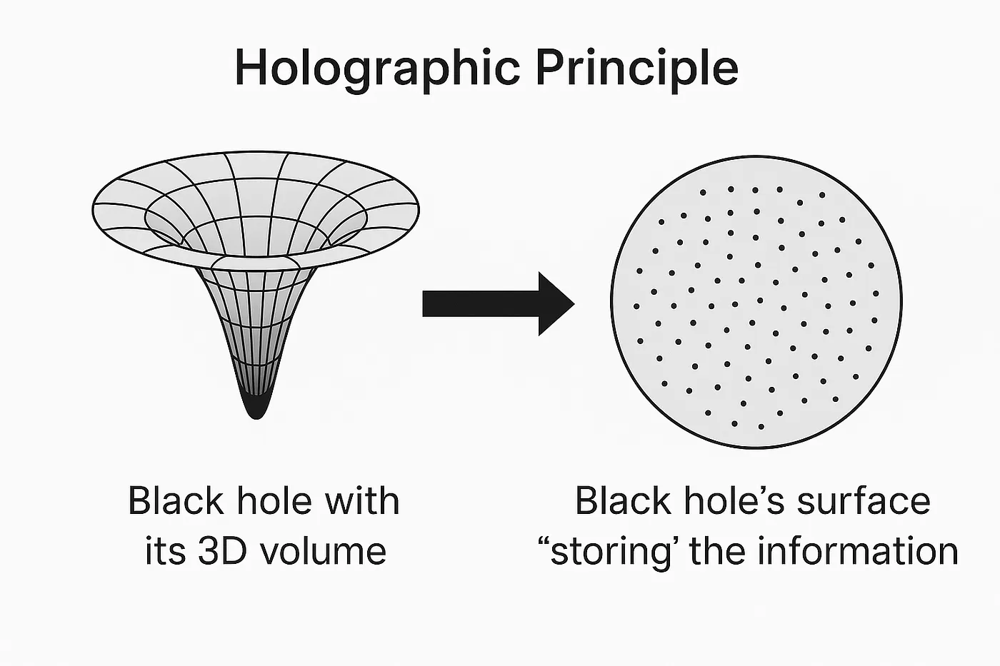

# AdS/QCD: Quantum Dynamics from Classical Gravity

## Modelling the Subatomic World
Protons and neutrons, the building blocks of atomic matter, are comprised of quarks bound together by the strong (nuclear) force. This force is mediated by gluons, the strength of which is set by the coupling constant $g$. As $g$ increases, the quarks stick together, forming bound states like the proton and neutron. For small $g$, the quarks and gluons are effectively free, producing a state of matter known as the quark-gluon plasma (QGP).
 
 
The value of $g$ where this transistion occurs, as well as whether the transition is smooth (second-order) or discontinuous (first-order), is of central importance when modelling the strong force. Unfortunately, whilst the field theoretic description of electromagnetism has been incredibly successful in describing electron-photon interactions, the field theory description of the strong force (known as quantum chromodynamics or QCD) breaks down in the crucial regime where quarks confine. This makes it impossible to compute observables such as the proton/neutron mass from first principles, not less understand the mechanism responsible for the state of the Universe as we see it today.
 
 
To break this impasse, we must formulate an alternate description of quark-gluon interactions that is valid for large $g$, the discovery of which takes us to the strangest objects in the Universe - black holes.

## Black Holes & the Information Paradox
Einstein's general relativity describes gravity as the curvature of spacetime caused by mass. Whilst typically only significant over large distances, the extreme density of a black hole can cause dramatic changes in the curvature of spacetime across the width of a single atom. As such, black holes are ideal objects for studying phenomena affected by both gravity and quantum mechanics.
 
 

    

        One example is Hawking radiation. Quantum field theory describes particles as local excitations of space-filling matter fields. Since the quantum vacuum has a non-zero energy density, virtual particles constantly appear from empty space, a phenomena known as vacuum fluctuations. To preserve charge, these fluctuations always come in the form of particle-antiparticle pairs, quickly re-annihilating with one another and returning their energy to the vacuum. However, with a source of energy and a mechanism for the particles to propogate independently, these virtual particles can become physical.
         
         
        In black hole, these requirements are fulfilled by the gravitational potential and the event horizon respectively. Vacuum fluctuations at the horizon of a black hole produce these pairs, with one falling into the black hole whilst the other, the Hawking radiation, escapes to infinity. Since the energy of the Hawking radiation is sourced by the gravitational field, an outside observer interprets this as particle emission, a process that gradually reduces the mass of the black hole until it eventually (after billions of years) evaporates.
         
         
    

    <figure>
        
        <figcaption>Hawking radiation arising from vacuum fluctuations about a black hole's event horizon. Adpated from S. Weinfurtner, Nature 569, 634-635 (2019)</figcaption>
    </figure>

Since the Hawking radiation was sourced just outside the event horizon, and we know that nothing from inside the horizon can escape outside, one must conclude that this radiation carries no information from the interior. Then we ask, if the black hole is to evaporate and disappear, what will become of the information that made it up? This is the <em>black hole information paradox</em>. To avoid this, we should carefully consider what an outside observer actually sees as an object approaches a black hole.

## Our World as a Hologram
We know that the warping of spacetime slows the internal clock of the infalling object relative to an outside observer, making it appear frozen at the event horizon as the Lorentz gamma factor diverges to infinity. From the perspective of the infalling object however, nothing special happens, it crosses the horizon as it would any region of space and begins its ill-fated descent towards the singularity.
 
 

    <figure>
        
        <figcaption>The holographic principle proposes that the information within a black hole exists on the boundary of its event horizon. Adapted from A.Popli, Medium magazine (2025)</figcaption>
    </figure>
    

        This suggests two complementary descriptions of the same physics: the bulk (interior) and the boundary (exterior). From the outside, infalling information isn't lost inside the black hole but preserved on the horizon, spreading out and entangling with existing degrees of freedom on the black hole's boundary. This is corroborated by the Bekenstein-Hawking entropy, which states that the information held by a black hole scales with its surface area and not its volume. The boundary description encodes the same information as the bulk, albeit in a scrambled, lower-dimensional form. Due to the difference in dimensionality, this concept is known as the <em>holographic principle</em>.
         
         
        As for our quantum fluctuations, Hawking radiation is now entangled with the degrees of freedom present on the boundary, carrying information away as the black hole evaporates. In principle, collecting all this emitted radiation would allow one to reconstruct everything that fell into the black hole, resolving the information paradox. 
    

Whilst interesting as a concept, it wasn't until the connection was made with a particular group of quantum field theories that the duality became one of the most insightful discoveries in modern physics.

## The AdS/CFT Correspondance
In its strongest form, the AdS/CFT correspondance proposes a duality between quantum gravity in a bulk Anti de Sitter (AdS) spacetime and a conformal field theory (CFT) living on the AdS boundary. In fact, we are more interested in the weak form of the duality, which relates classical gravity to a strongly-coupled CFT. It states:
 
 
> a supersymmetric four-dimensional strongly-interacting conformal field theory with a large number of colour (gauge) charges is equivalent to classical supergravity on a ten-dimensional $AdS_5\times S_5$ background

This statement contains a lot of terminology which will not be explained in detail here. The important features to note are the additional assumptions and symmetries present in this duality that we wish to break in order to describe real-world QCD. They are:
 
 
* Conformal symmetry: conformal field theories are quantum field theories that are invariant under a change in scale, i.e. you can blow objects up or shrink them down relative to one another without affecting the system. There is also no concept of mass, since the presence of a massive object would introduce an energy scale into the theory.  

* Supersymmetry: a symmetry between matter particles (fermions) and force carriers (bosons) which effectively doubles the particle content of the standard model. This appears because supergravity is the low-energy limit of string theory, which requires supersymmetry to avoid tachyons and describe matter.  

* Large $N$: QCD has three colour charges - red, blue and green. The CFT in this correspondance has an infinte number, an assumption that allows the string theory to be weakly-coupled and thus described by classical (tree level) supergravity.  

The power of this correspondance stems from the fact that a strongly-coupled quantum field theory living on the boundary of an $AdS_5 \times S_5$ spacetime can be completely described by a classical theory of gravity defined in the bulk. Calculations that are mathematically impossible due to the largeness of $g$ in QCD become mapped to numerically solvable quantities in the bulk, such as the low-energy quark masses being dual to the fluctuations of supergravity fields in $AdS_5 \times S_5$.

## CFT $\rightarrow$ QCD

